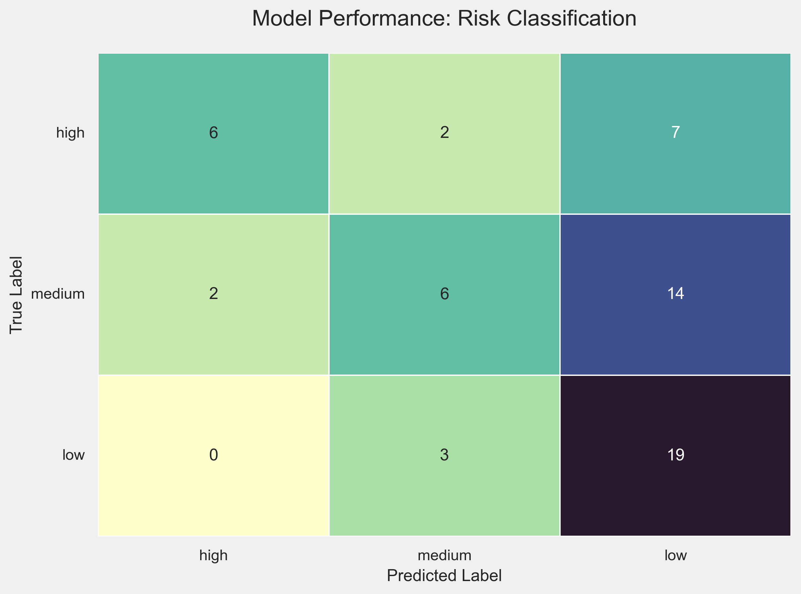

# A Multi-Phase Project for Risk Analysis

## Overview

This project applies natural language processing (NLP), rule-based techniques, and semantic search to support real-world compliance and risk review workflows.

Inspired by challenges I've encountered in my professional role, this project transforms large-scale unstructured legal texts into structured, actionable insights. Built independently using public data, it demonstrates a practical, end-to-end process for identifying relevant cases, surfacing risk signals, and creating a transparent, auditable analysis pipeline.

## Project Phases & Roadmap

| Phase                                              | Status     | Key Milestone |
|---------------------------------------------------|------------|-----------------------------------|
| Phase 1: Rule-Based Classification & Evaluation   | Completed | A quantitatively evaluated Triage model that assigns risk labels (high, medium, low) to legal rulings.
| Phase 2: Semantic Search & RAG Enhancements       | In Progress | Address the 40% recall from Phase 1 by implementing semantic search to find cases that our rule set miss.              
| Phase 3: Optimization & System Design             | Upcoming | Focus on scaling the system and preparing for production deployment.

## Phase 1 Results & Key Findings

The refined Triage model from Phase 1 was evaluated against a manually labeled ground truth set of 59 documents.

* **Precision (for `high` risk): 75%**
* **Recall (for `high` risk): 40%**

<p align="center"></p>


> **Conclusion:** The model is a successful proof-of-concept. It is **reliable** when it flags a case as high priority (good precision), but it is not yet **comprehensive** (low recall). This result provides a strong quantitative baseline and a clear, data-driven justification for moving to more advanced methods in Phase 2.

## Tech Stack

- **Languages**: Python
- **Tools**: JupyterLab, Git, GitHub

- **Phase 1 Libraries**: `pandas`, `re`, `scikit-learn`, `matplotlib`
- **Libraries for Future Phases**: `spacy`, `sentence-transformers`, `faiss`, `transformers` (Hugging Face), `langchain`, `streamlit`


- **Phase 1 Concepts & Methods**: Text Normalization, Rule-Based Classification, Manual Refinement, Model Evaluation (Precision, Recall, Confusion Matrix)

## Data Source

The data used in this project comes from [CourtListener](https://www.courtlistener.com/), an open-access repository of legal opinions maintained by the Free Law Project. CourtListener provides bulk downloads and APIs containing court rulings from U.S. federal and state courts, including appellate decisions with full-text legal opinions.

## Project Structure
```
compliance-nlp/
│
├── data/                                
│   ├── raw/                                 # Unprocessed fetched files from CourtListener (raw txt)
│   ├── processed/                           # All data generated by the notebooks
│   │   ├── party_and_decision_metadata.csv  # Cleaned output from notebook 02
│   │   └── decisions_with_risk_labels.csv   # The final annotated dataset from Phase 1
│   ├── labels.csv                           # The initial, baseline rule set
│   ├── labels_updated.csv                   # The primary rule set, refined after review
│   └── ground_truth_labels.csv              # The human-labeled "answer key" for evaluation
│
├── notebooks/                               # Jupyter notebooks for exploration and prototyping
│   ├── 01_fetch_opinions.ipynb              # Fetch and store rulings from CourtListener's API 
│   ├── 02_load_and_clean_rulings.ipynb      # Clean and normalize text for further processing
│   ├── 03_rule_based_labeling.ipynb         # Develops, refines, and evaluates the Phase 1
│
├── src/                                     # Modular Python code
│   ├── preprocessing.py                     # Functions for text cleaning and normalization
│   └── rule_based_labeling.py               # Core functions for the Triage model in phase 1
│
├── images/
│   └── confusion_matrix_final.png           # Visuals for the README and analysis
│
├── README.md                                # Project documentation
├── config.py                                # Configuration 
├── requirements.txt                         # Environment setup
└── .gitignore                               # Files and folders to exclude from Git
```


## Use Cases & Project Vision

The end-goal of this multi-phase project is to create an integrated system that supports deep, contextual analysis of legal texts. The ultimate use case is to:

> *Allow a compliance analyst to input a specific legal concern or clause and retrieve the most relevant rulings. The system would return top-matching documents based on semantic similarity and automatically assign risk tags based on both explicit rules and nuanced language cues.*

Each phase of this project builds a critical component of that final vision:

* **Phase 1 (Completed): Batch Triage & Prioritization**
    * This foundational phase provides a robust system to process an entire corpus of documents and assign a clear risk label (`high`, `medium`, `low`) to each one. Its primary value is in dramatically reducing manual review time by allowing analysts to instantly filter for and prioritize the most critical cases.

* **Phase 2 (In Progress): Interactive Querying & Semantic Search**
    * This phase will build on the foundation by introducing semantic search. This will allow an analyst to move beyond fixed rules and find documents that are *conceptually similar* to a query, even if they don't share the same keywords. This directly addresses the recall limitations discovered in Phase 1.


## Data Processing & Schema

The court rulings retrieved from CourtListener follow a semi-structured format. Each ruling typically includes:

- **Metadata**: Case name, date, court, docket number, and legal representatives  
- **Procedural Context**: Explanation of how the case arrived at the court (e.g., appeals, motions)  
- **Decision and Order**: The court’s final ruling and legal reasoning  
- **Legal Citations**: References to relevant statutes and past cases

The raw text files from CourtListener are processed by the `02_load_and_clean_rulings.ipynb` notebook into a structured `pandas` DataFrame. This DataFrame serves as the primary input for the analysis.

For this initial phase, I focused on extracting three key fields: `doc_index`, `party_line`, and the full `decision_text`.

**Example DataFrame Structure:**

| doc_index | party_line | decision_text |
| :--- | :--- | :--- |
| 1 | Maria Airene Pantanilla, respondent, v Guillerma Yuson, appellant. | "In an action, in effect, to recover damages for money had and received and unjust enrichment, the defendant appeals from a judgment... a default judgment was entered in favor of the plaintiff for $40,000." |
| ... | ... | ... |

While the raw data contains additional metadata (like court, date, docket number, etc.), I made a strategic decision to defer full metadata extraction to a future phase. This allowed me to keep the scope of Phase 1 focused on building and validating the core text analysis and classification pipeline.

## Future Work (Phase 2 & 3)

The successful completion of this rule-based classification phase provides the perfect foundation for the next steps. The quantitative evaluation of Phase 1 gives us a data-driven mandate to explore more advanced techniques.

1.  **Improve Recall with Semantic Search (Phase 2):**
    * The top priority is to address the 40% recall from the Triage model. I will implement a semantic search pipeline using SBERT and FAISS to find conceptually similar documents that our rule dictionary currently misses. This will provide a powerful new layer of risk detection.

2.  **Compare with Advanced Methods (Phase 2):**
    * Using our **`ground_truth_labels.csv`** as a high-quality evaluation set, I will benchmark the rule-based model against an LLM-based classifier. This will likely involve using examples from the ground truth set for few-shot prompting in a RAG system, allowing for a direct, objective comparison of the two approaches.

3.  **Build an Interactive Demo (Phase 2/3):**
    * To showcase the results of these models, I will develop a simple web application using Streamlit. This will allow a user to paste in text or query the system and see the risk classification and semantic search results in real time.

4.  **System Design & Deployment (Phase 3):**
    * The final phase will focus on productionization. I will design the architecture for a scalable system capable of handling thousands of new documents daily, including containerizing the final application with Docker for consistent and reproducible deployment.

